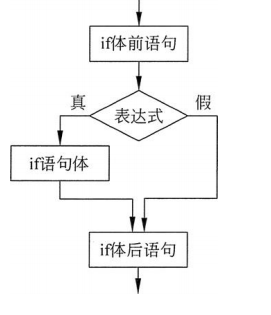

# STC8编程手册

程序模块主要是和 C 语言相关的模块。

### 控制模块 


#### 1. 延时1/5/10/50/100微秒。

> 图形化模块提供了常用几种微秒级的延时函数，每个函数都是在频率为 24M 下，利用STC-ISP 工具计算出来的函数。如需要其它微秒级的延时函数，请自己使用工具计算。


```c
delay1us();
delay5us();
delay10us();
delay50us();
delay100us();
```


#### 2. 毫秒级延迟函数。

> 以 24M 频率下的 1 毫秒延时函数为最小单位。


```c
    #include "lib/delay.h"
    delay(1000);
```

> 内部实现代码

```c
//=====================================================================
// 描述: 延迟 1 毫秒.
// 参数: none.
// 返回: none.
//=====================================================================

void delay1ms() //1 毫秒@24.000MHz
{
    uint8 i, j;
    _nop_();
    i = 32;
    j = 40;
    do { while (--j);} while (--i);
}

//=====================================================================
// 描述: 延迟指定毫秒.
// 参数: 延迟时间（0-65535）.
// 返回: none.
//=====================================================================
void delay(uint16 time)
{
    do { delay1ms();} while (--time);
}

```

#### 3. 空指令。

> 执行一个指令需要的时间，由系统频率确定，用在需要精确时间的场合里，比如前面的微秒级的延时函数内部，就是由 nop 组成。

```c
_nop_();
```

#### 4. 如果判断分支语句。

> 如果条件判断成立，则执行里面的代码，否则不执行。


```c
if(0){

 }
```



> 还可以通过点击蓝色小齿轮，添加多个判断语句。 如下为如果否则判断分支语句：
>
> 如果条件判断成立，则执行如果里面的代码，否则执行否则里的代码。

