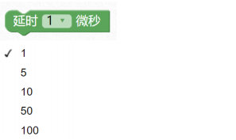
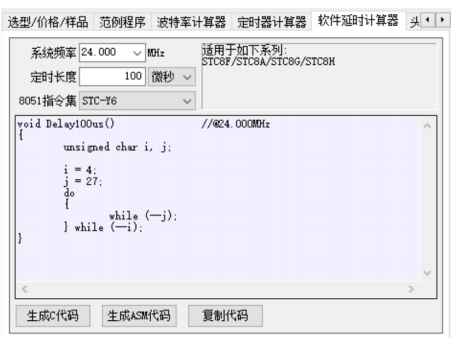

### 1. 延时1/5/10/50/100微秒。

> 图形化模块提供了常用几种微秒级的延时函数，每个函数都是在频率为 24M 下，利用STC-ISP 工具计算出来的函数。如需要其它微秒级的延时函数，请自己使用工具计算。



```c
delay1us();
delay5us();
delay10us();
delay50us();
delay100us();
```



### 2. 毫秒级延迟函数。

> 以 24M 频率下的 1 毫秒延时函数为最小单位。


```c
#include "lib/delay.h"
delay(1000);
```
> 内部实现代码


